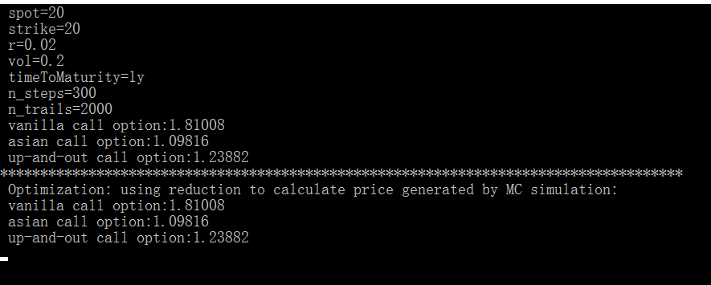
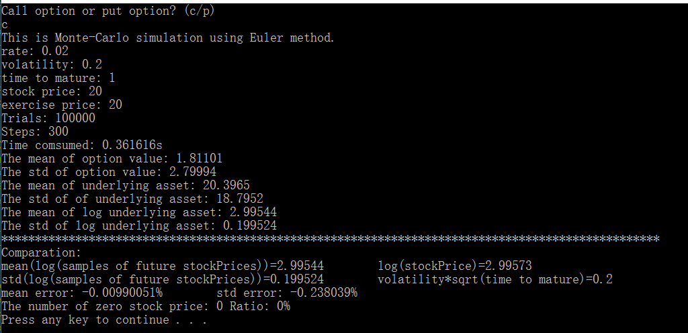
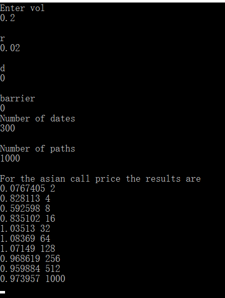
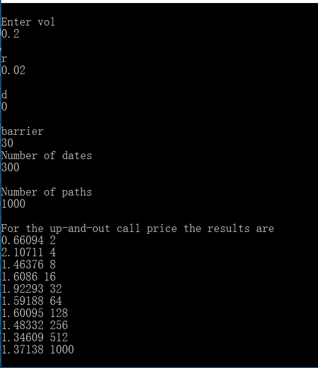

#Final Project

##Files
* GPUEngine: The updated version of OldGPUEngine. It is made to handle path dependent exotic option pricing using GPU tech. Inspired by the SNN codes in github.
* OldGPUEngine: Classic functional programming.
* OptionSystem: Ultimate goal of my project. Combining all pricing modules into a bascket system. However, it is relatively finished only in c++ part. So, it can be used as an alternative and comparison.

##Intent
In my project, the goal is to construct an option pricing system as codes in folder GPUOptionSystem. I have implement the most part of c++ part and some skeleton for GPU part.

However, the GPU part(most of them are skeleton) I wrote in GPUOptionSystem is wrong because CUDA doesn't support all features of c++. For example, cuda class do not allow dynamic polymorphism which is a base of most pattern.

Inspired from your guidance, I reconstruct a project named GPUEngine. And I defined a class to handle path-dependent option.

##Features
* Can price both vanilla options and exotic time dependent options (Asian or knock-out option)
* Transfer the computation of mean pricing into device by reduction. Much more quickly.
* Object-Oriented programming tried on cuda

##Results
* GPU engine result:(GPUEngine->kernal)

* Old GPU engine result for vanilla option(OldGPUEngine->Euler_Euro_Option.cu)

* CPU asian engine result(OptionSystem->AsianCallMain):

* CPU up-and-out engine result(OptionSystem->UpAndOutCallMain):

##Conclusions
1. Although OO programming brings a lot of convenient especially in group project. An unpropered construction of class can cause memory shortage which may restrain our number of trials awfully. Exactly as you mentioned before. 
2. GPU engine is much more powerful than cpu engine.

##Problems and todo list:
1. my visual studio do not identify function __syncthreads() for some reason(do you know the reason?)
2. If the above problem can be solved. The random number generator can be more efficient by initializing curandState_t array once.
3. The structure remains lots of redundant codes.
4. Switch from geometric brownian motion to stochastic volatility model(Heston Model)

##Reference

Engler, Gary. "timeSeriesSNN." github, 2017, https://github.com/gengler1123/GPU-Computing-For-Finance. Accessed 14 Feb. 2017

Joshi, M. S. (2004). C++ Design Patterns and Derivatives Pricing (Mathematics, Finance and Risk) (2nd ed.). N.p.: Cambridge University Press.

Sanders, Jason, and Edward Kandrot. CUDA by Examplean: an introduction to general-purpose GPU programming. 1 ed., Addison-Wesley Professional, 2010.

